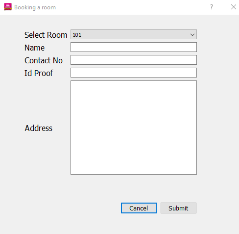
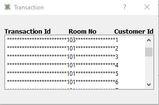
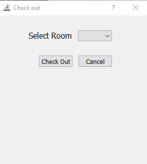
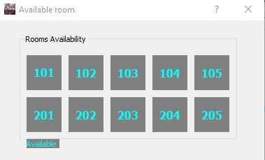
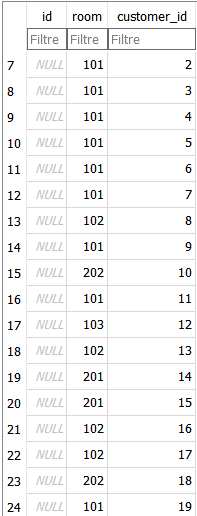
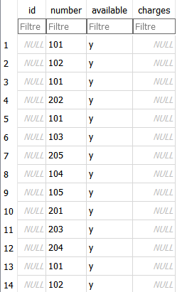
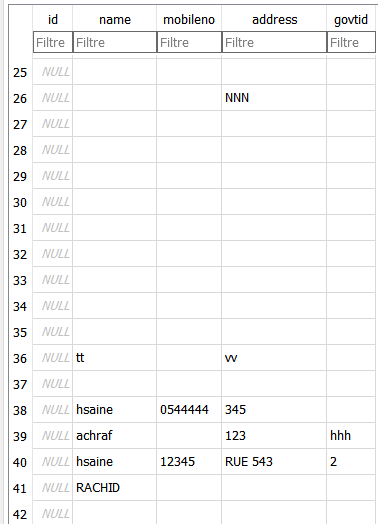

<h1 align="center">System Hotel Management</h1>
 <p align="center"> <br> Hotel Managment</p> 


<h1 align="center">Introduction</h1>

As part of our first year in engineering, specializing in robotics and cobotics at the School of Digital Engineering and Artificial Intelligence at the euromed University of Fez, our professor proposed to us to create an application as a final project after we are finished the course of human-machine interaction using **QT designer c++**.
If you want to know more information about this course click on the link bellow:
<https://anassbelcaid.github.io/CS311/>
<h1 align="center">Thankfulness</h1>

First of all, to begin this report, we would like to express our thanks to
our professor.***Belcaid Anass*** who has not stopped encouraging us during the
duration of the project, as well as its generosity in terms of training and supervision,
for the quality of his exceptional coaching, his patience, his rigour and his
availability during our preparation of this project.
We would like to thank my team who contributed to the success of our project
tutor who helped us a lot in the development of our project.

<h1 align="center">About Application</h1>

System Hotel Management is an appliaction created by **Qt Creator using C++**,is an application allow clients to check firstly the available rooms, then you can book a available room, after this operation we will show your id_number that is mean your number as client in our service when you click on **Transaction Button**,finnally when you want to leave the hotel just check out in order to make the room available for an other client.

<h1 align="center">Steps To use Application</h1>

First of all you should to do, it to go the menu bar:
1. click on **BARAHA HOTEL** then **About Hotel** to show information about our services.
2. click on **Price** to know the price of each room category.
3.  Check the availibilty of the rooms.
4.  Now, we move to button**roombooking**,click on it, fill in the form and click on **sumbit**to valid the reservation.
5.  If you want to know your ID as client,you should click on **trasaction**.
6.  You can quit the application,go to menu bar, click on **BARAHA HOTEL** then**Exit** 
7.  When you want to check out the hotel, go to**Button: check out** and choose the number of room selected in your reservation, click on check out and automaticaly you will quit the application.
8.  We hope you had a good time. 


<h1 align="center">How Application is built?</h1>

1. Our application contain five forms,each one have a specific task to do,the first one is the **mainwindow.ui**:Is the principle form, it contain:menubar,toolbar,Qaction,PushButtons,picture of hotel,calendar...you will find in the table bellow details of forms that remain:

| Form        | Execution   | Description   |
| :---        |    :----:   | :---          |
| bookroomdialog.ui      | <p> </p>       | This form contain a dialog that client should fill in when he/she click on **room booking** after checking the availibillity of rooms,you should be select a room and put all information.<br>it contain labels,combobox,lineedit,two pushbutton and verticalspacer   |
| transaction.ui   | <p> </p>        | This form contain label and a listwidget that show the id of client and and the numer of room selected       |
| chechoutdialog.ui   | <p> </p>          | This form is a dialog contain a combobox,label and pushbutton to valid your check out      |
| roomavailabledialog.ui   | <p> </p>          | This form is a dialog contain labels for number of rooms and a groupbox gather this labels.        |


2. The **menubar** contain **tree menu** each one have two **QAcion**,the first menu:**BARAHA Hotel**,the first action display information about the hotel,the second to quit the application,the second menu:**Price**, the both action display the price of each room category,the last menu:**Help** display inforamation about QT and the application.
3. Each Action have an icon and each dailog form have as well an icon.
4. THe size of all forms is fixed.
5. The toolbar contain all icons of the actions.
6. We are trying to use maximum concepts and tools in this course.
7. The application is built using **MVC Model** especially SQLDATABASEMODEL.is responsible for managing of database .
8. Also we are using **Item Based** especially Listwidget in the form transaction.


<h2 align="center">Code Source</h2>

* The class hotel: is contained the implimentation of the **method bookroom** it responsible to insert all information of customer in all tables (bookroom,trasaction)and **method check out** responsible to check out, it contain the code if customer want to quit the hotel and update the room to make it available.**the vector getroomlist** is responsible to select  all rooms form database in order to dispaly its when we call it in available room and **getinstance** is to get instance form the class hotel(is construction of hotel class).
* Mainwindow class: contain all button click slots each one responsible for a task,all of them displays what you will explain in each bellow class,also it contain the implimentation of slots of other action like single room information about QT... 
* bookroom class :contain a method **readdata** and two slots (sumbit and cancel),the method **readdata**:is responsible to get and select all rooms from database using the vector getroomlist and browse all to display it in combobox,and **cancel button** is to quit if you don't want to complete the reservation, and **sumbit** to get the information in database.
* checkout class : contain a method **readdata** and two slots (checkout and cancel),the method readdata:is responsible to get and select all rooms booking from database using the vector getroomlist and browse the all vector to display it in combobox and the client choose the room that has selected and check out,and **cancel button** is to quit if you don't want to check out, and **checkout** to check out the hotel and when you click on this button the database is updating and the room will be available again and you will quit automatically the application. 
* roomavailbale class: the background of labels that contain numbers display in grey color and numbers with aqua color when we book a room the background of label change to lightgrey.
* ttansaction class : responsible to get the attributes from table transaction ad disply it on the listwidget .
<details>
<summary>Headers</summary>
<br>
 
<details>
<summary>bookroomdialog.h</summary>
<br>
 
```
#ifndef BOOKROOMDIALOG_H
#define BOOKROOMDIALOG_H
#include <QDialog>
#include <QtDebug>
#include <QSqlDatabase>
#include <QSqlDriver>
#include <QSqlError>
#include <QSqlQuery>
#include <QFile>
#include <vector>
#include <QMessageBox>

#include "hotel.h"

namespace Ui {
class BookRoomDialog;
}

class BookRoomDialog : public QDialog
{
    Q_OBJECT

public:
    explicit BookRoomDialog(QWidget *parent = nullptr);
    ~BookRoomDialog();
    void readData();

    QString getname()const;
    int combobox()const;
    QString getaddres()const;
    QString getphone()const; 

private slots:
    void on_btnCancel_clicked();
    void on_btnSubmit_clicked();

private:
    Ui::BookRoomDialog *ui;

};

#endif // BOOKROOMDIALOG_H

```
</details>

<details>
<summary>checkoutdialog.h</summary>
<br>
 
```
#ifndef CHECKOUTDIALOG_H
#define CHECKOUTDIALOG_H

#include <QDialog>
#include <QDebug>
#include <QSqlQuery>
#include <QFile>
#include <QSqlDatabase>
#include <QSqlError>
#include <hotel.h>
#include <QMessageBox>

namespace Ui {
class CheckOutDialog;
}

class CheckOutDialog : public QDialog
{
    Q_OBJECT

public:
    explicit CheckOutDialog(QWidget *parent = nullptr);
    ~CheckOutDialog();
    void readData();
    //int box()const;


private slots:
    void on_btnCancel_clicked();
    void on_btnCheckout_clicked();
private:
    Ui::CheckOutDialog *ui;
};

#endif // CHECKOUTDIALOG_H
 
```
</details>
  
  
<details>
<summary>roomavailabledailog.h></summary>
<br>
 
```
#ifndef ROOMAVAILABLEWINDOW_H
#define ROOMAVAILABLEWINDOW_H
#include <QDialog>
#include <QDebug>
#include <hotel.h>

namespace Ui {
class RoomAvailableDialog;
}

class RoomAvailableDialog : public QDialog
{
    Q_OBJECT

public:
    explicit RoomAvailableDialog(QWidget *parent = nullptr);
    ~RoomAvailableDialog();
    void readData();

    QString groupBox()const;
private slots:
    void on_pushButton_clicked();

private:
    Ui::RoomAvailableDialog *ui;
};
#endif // ROOMAVAILABLEWINDOW_H
 
```
</details> 
  
<details>
<summary>transaction.h</summary>
<br>
 
```
#ifndef TRANSACTION_H
#define TRANSACTION_H
#include <QSqlDatabase>
#include <QSqlDriver>
#include <QSqlError>
#include <QSqlQuery>
#include <QFile>
#include <QDebug>
#include <QSqlTableModel>
#include <QDialog>

namespace Ui {
class transaction;
}

class transaction : public QDialog
{
    Q_OBJECT

public:
    explicit transaction(QWidget *parent = nullptr);
    void readData();
    ~transaction();

private:
    Ui::transaction *ui;
};
#endif // TRANSACTION_H
 
```
</details> 
  
  
<details>
<summary>hotel.h</summary>
<br>
 
```
#ifndef HOTEL_H
#define HOTEL_H

#include <QDialog>
#include <QDebug>
#include <QSqlQuery>
#include <QFile>
#include <QSqlDatabase>
#include <QSqlError>
#include<vector>

class Hotel
{
private:
    Hotel(){}
    Hotel(Hotel const &){}
    static Hotel * instance;
    void updateHotelData(int room); //update DB & Vector

public:
    int BookRoom(int roomno, QString name, QString contactno, QString govid, QString address);
    int CheckOut(int roomno);
    std::vector<int> RoomAvailability();
    std::vector<int> getRoomList(QString);  //return vector
    static Hotel* getInstance();

};

#endif // HOTEL_H
 
```
</details> 
  
<details>
<summary>mainwindow.h</summary>
<br>
 
```
#ifndef MAINWINDOW_H
#define MAINWINDOW_H

#include <QMainWindow>
#include "bookroomdialog.h"
#include "checkoutdialog.h"
#include "roomavailabledialog.h"
#include "transaction.h"

namespace Ui {
class MainWindow;
}

class MainWindow : public QMainWindow
{
    Q_OBJECT

private:
    RoomAvailableDialog * ptrRoomAvailableDlg;
    CheckOutDialog * ptrCheckOutDlg;
    BookRoomDialog * ptrRoomBookingDlg;
    transaction * ptrTransaction;

public:
    explicit MainWindow(QWidget *parent = nullptr);
    ~MainWindow();

private slots:
    void on_btnRoomBooking_clicked();
    void on_btnRoomCheckout_clicked();
    void on_btnCheckAvailability_clicked();
    void on_bntTransaction_clicked();
    void on_actionAbout_Application_triggered();

    void on_actionAbout_QT_triggered();

    void on_actionInformation_BARAHA_Hotel_triggered();

    void on_actionExit_triggered();

    void on_actionSingle_room_triggered();

    void on_actionDouble_room_triggered();

private:
    Ui::MainWindow *ui;
};

#endif // MAINWINDOW_H
 
```
</details> 
  
</details>

<details>
<summary>Sources</summary>
<br>
 
<details>
<summary>bookroomdialog.cpp</summary>
<br>
 
```
#include "bookroomdialog.h"
#include "ui_bookroomdialog.h"

BookRoomDialog::BookRoomDialog(QWidget *parent) :
    QDialog(parent),
    ui(new Ui::BookRoomDialog)
{
    ui->setupUi(this);
    this->setWindowTitle("Booking a room");
    this->setFixedSize(500,500);
    this->setWindowIcon(QIcon(":/booking_room.jpg"));

}

void BookRoomDialog:: readData()
{
    qDebug()<<"BookRoomDialog:readData";
    std::vector<int>rooms = Hotel::getInstance()->getRoomList("y");
    this->ui->cmbRoomList->clear();

    for(std::vector<int>::iterator it = rooms.begin(); it!=rooms.end(); it++ )
    {
        this->ui->cmbRoomList->addItem(QString::number(*it));
    }
}

BookRoomDialog::~BookRoomDialog()
{
    delete ui;
}

void BookRoomDialog::on_btnCancel_clicked()
{
    this->hide();
}

void BookRoomDialog::on_btnSubmit_clicked()
{
    //call hotel's book room
    int  roomno = ui->cmbRoomList->currentText().toInt();
    QString name = ui->txtName->text();
    QString contactno = ui->txtContactNumber->text();
    QString address = ui->txtAddress->toPlainText();
    QString govtid = ui->txtIdProof->text();


  //  query.prepare("insert into cppbuzz_customer (name, mobileno, govtid, address) values ('" + name + "','" + contactno + "','" + govtid + "','" + address + "')");


    if(roomno < 1)
    {
            QMessageBox::information(
            this,
            tr("Warning!"),
            tr("We are sold out. No room is available") );
            return;
     }

    int ret = Hotel::getInstance()->BookRoom(roomno, name, contactno, govtid, address);

    QString msg = "";
    ret==0?msg="Success!":"Failure!";

    this->hide();

    if(ret == 0)
    {
        QMessageBox::information(
        this,
        tr("Success!"),
        tr("Room has been booked! Please ask for Govt. Id from customer") );
    }
}

//QString BookRoomDialog::getname() const{
//    return ui->txtName->text();

//}

//QString BookRoomDialog::getphone() const{
//    return ui->txtContactNumber->text();


//}

//int BookRoomDialog::combobox() const{
//    return ui->cmbRoomList->currentText().toInt();


//}
//QString BookRoomDialog::getaddres() const{
//    return ui->txtAddress->toPlainText();

//}
 
```
</details>

  
<details>
<summary>checkoutdialog.cpp</summary>
<br>
 
```
#include "checkoutdialog.h"
#include "ui_checkoutdialog.h"
#include "QDebug"

CheckOutDialog::CheckOutDialog(QWidget *parent) :
    QDialog(parent),
    ui(new Ui::CheckOutDialog)
{
    ui->setupUi(this);
    this->setWindowTitle("Check out");
    this->setFixedSize(300,300);
    this->setWindowIcon(QIcon(":/check-out.jpg"));
    qDebug()<<"in constructor of CheckOutDialog";
}


void CheckOutDialog::readData()
{
    std::vector<int>rooms = Hotel::getInstance()->getRoomList("n");
    this->ui->comboBox->clear();

    char flag = 0;
    for(std::vector<int>::iterator it = rooms.begin(); it!=rooms.end(); it++ )
    {
        this->ui->comboBox->addItem(QString::number(*it));
        flag = 1;
    }

    if(flag==1) this->ui->btnCheckout->setEnabled(true);

}
CheckOutDialog::~CheckOutDialog()
{
    delete ui;
}

void CheckOutDialog::on_btnCancel_clicked()
{
    this->show();
}

void CheckOutDialog::on_btnCheckout_clicked()
{

    //call hotels's checkout
    int  roomno = ui->comboBox->currentText().toInt();

    if(roomno < 1)
    {
            QMessageBox::information(
            this,
            tr("Warning!"),
            tr("No room to Check out") );
            return;
     }
    int ret = Hotel::getInstance()->CheckOut(roomno);

    QString msg = "";
    ret==0?msg="Success!":"Failure!";

    this->hide();

    if(ret == 0)
    {
        QMessageBox::information(
        this,
        tr("Success!"),
        tr("Room has been Check-out! Say thank you to Customer") );
    }
}


//int CheckOutDialog::box() const{
//    return ui->comboBox->currentText().toInt();

//}
 
```
</details>
  
<details>
<summary>roomavailabledialog.cpp</summary>
<br>
 
```
#include "roomavailabledialog.h"
#include "ui_roomavailabledialog.h"
#include <QDebug>

RoomAvailableDialog::RoomAvailableDialog(QWidget *parent) :
    QDialog(parent),
    ui(new Ui::RoomAvailableDialog)
{
    ui->setupUi(this);
    this->setFixedSize(380,200);
    this->setWindowTitle("Available room");
    qDebug()<<"In RoomAvailableDialog()";
    //this->setWindowIcon(QIcon(":/available.jpg"));


}

void RoomAvailableDialog::readData()
{
    qDebug()<<"in readData()";

    std::vector<int>rooms = Hotel::getInstance()->getRoomList("y");
    ui->lblinfo->setStyleSheet("QLabel { background-color : grey; color : aqua; }");

    std::vector<int>temprooms =  {101, 102, 103, 104, 105, 201, 202, 203, 204, 205};

    //set default color to all
    for(std::vector<int>::iterator it = temprooms.begin(); it!=temprooms.end(); it++ )
    {
        //Put logic to change color of Labels
        QString lblname = "lbl" + QString::number(*it);
        QLabel * ptr = this->findChild<QLabel*>(lblname);

        if(ptr)
        {
            ptr->setStyleSheet("QLabel { background-color : lightgrey; color : aqua; }");
        }

    }

    for(std::vector<int>::iterator it = rooms.begin(); it!=rooms.end(); it++ )
    {
        //Put logic to change color of Labels
        QString lblname = "lbl" + QString::number(*it);
        QLabel * ptr = this->findChild<QLabel*>(lblname);

        if(ptr)
        {
            //pLabel->setStyleSheet("QLabel { background-color : red; color : blue; }");

            ptr->setStyleSheet("QLabel { background-color : grey; color : aqua; }");
        }

    }
}

RoomAvailableDialog::~RoomAvailableDialog()
{
    qDebug()<<"Deleting RoomAvailableDialog";
    delete ui;
}

QString RoomAvailableDialog::groupBox()const{
        return ui->lbl101->text();
        return ui->lbl102->text();
        return ui->lbl103->text();
        return ui->lbl104->text();
        return ui->lbl105->text();
        return ui->lbl201->text();
        return ui->lbl202->text();
        return ui->lbl203->text();
        return ui->lbl204->text();
        return ui->lbl205->text();


}
void RoomAvailableDialog::on_pushButton_clicked()
{
    this->hide();
}
  
```
</details> 
  
<details>
<summary>transaction.cpp</summary>
<br>
 
```
#include "transaction.h"
#include "ui_transaction.h"

transaction::transaction(QWidget *parent) :
    QDialog(parent),
    ui(new Ui::transaction)
{
    ui->setupUi(this);
    this->setFixedSize(320,180);
    this->setWindowTitle("Transaction ");
   this->setWindowIcon(QIcon(":/transaction-icon.jpg"));

}
void transaction::readData()
{
    QSqlDatabase Database = QSqlDatabase::addDatabase("QSQLITE");
    Database.setDatabaseName("C:\\Users\\Hsaine\\Desktop\\Hotel_Management_in_QT (1)\\Hotel_Management_in_QT (1)\\data");
    if(QFile::exists("C:\\Users\\Hsaine\\Desktop\\Hotel_Management_in_QT (1)\\Hotel_Management_in_QT (1)\\data"))
        qDebug() << "DB file exist";
    else
       qDebug() << "DB file doesn't exists";

    if (!Database.open())
        qDebug() << Database.lastError().text();
    else
        qDebug() << "Database loaded successfull!";

    QSqlQuery query(Database);
    query.prepare("select * from cppbuzz_transaction");

    if(!query.exec())
        qDebug() << query.lastError().text() << query.lastQuery();
    else
        qDebug() << "Update was successful "<< query.lastQuery();


     while(query.next())
     {

         this->ui->lstWidget->addItem(query.value(0).toString() +"************************"+ query.value(1).toString() +"****************"+ query.value(2).toString());
         qDebug() << query.value(0).toString() << " " << query.value(1).toString() << query.value(2).toString();
     }

     Database.close();
}
transaction::~transaction()
{
    delete ui;
}
  
```
</details>  
  
<details>
<summary>hotel.cpp</summary>
<br>
 
```
#include "hotel.h"
#include "QDebug"
#include<QMessageBox>
#include <checkoutdialog.h>

Hotel* Hotel::instance = nullptr;
int Hotel::CheckOut(int roomno)
{
    qDebug()<<"in CheckOut for room no : " << roomno;
    //**** update DB **********

    QSqlDatabase Database = QSqlDatabase::addDatabase("QSQLITE");
    Database.setDatabaseName("C:\\Users\\Hsaine\\Desktop\\Hotel_Management_in_QT (1)\\Hotel_Management_in_QT (1)\\data");
    if(QFile::exists("C:\\Users\\Hsaine\\Desktop\\Hotel_Management_in_QT (1)\\Hotel_Management_in_QT (1)\\data"))
        qDebug() << "DB file exist";
    else
       qDebug() << "DB file doesn't exists";

    if (!Database.open())
        qDebug() << Database.lastError().text();
    else
        qDebug() << "Database loaded successfull!";

    QSqlQuery query(Database);
    query.prepare("update cppbuzz_room set available ='y' where number='" +QString::number(roomno)+ "'");

    if(!query.exec())
        qDebug() << query.lastError().text() << query.lastQuery();
    else
        qDebug() << "Update was successful "<< query.lastQuery();


    Database.close();
    //getRoomList();
    CheckOut(roomno);
    return 0;
}

int Hotel::BookRoom(int roomno, QString name, QString contactno, QString govtid, QString address)
{
    qDebug() << "in BookRoom for room no : "<< roomno;

    //**** update DB **********


    QSqlDatabase Database = QSqlDatabase::addDatabase("QSQLITE");
    Database.setDatabaseName("C:\\Users\\Hsaine\\Desktop\\Hotel_Management_in_QT (1)\\Hotel_Management_in_QT (1)\\data");
    if(QFile::exists("C:\\Users\\Hsaine\\Desktop\\Hotel_Management_in_QT (1)\\Hotel_Management_in_QT (1)\\data"))
        qDebug() << "DB file exist";
    else
       qDebug() << "DB file doesn't exists";

    if (!Database.open())
        qDebug() << Database.lastError().text();
    else
        qDebug() << "Database loaded successfull!";

   QSqlQuery query(Database);
 //query.prepare("insert into cppbuzz_room (number) values ('"+QString::number(roomno)+ "')");

    if(!query.exec())
        qDebug() << query.lastError().text() << query.lastQuery();
    //prepare hotel room query
    query.prepare("update cppbuzz_room set available ='n' where number='" +QString::number(roomno)+ "'");
    if(!query.exec())
        qDebug() << query.lastError().text() << query.lastQuery();
    else
        qDebug() << "Update was successful "<< query.lastQuery();

    //prepare customer query
    query.clear();
    query.prepare("insert into cppbuzz_customer (name, mobileno, govtid, address) values ('" + name + "','" + contactno + "','" + govtid + "','" + address + "')");
    QString customer_id;
    if(!query.exec())
        qDebug() << query.lastError().text() << query.lastQuery();
    else
    {
        qDebug() << "Update was successful "<< query.lastQuery();
        customer_id = query.lastInsertId().toString();
        qDebug() <<"Last Inserted Id is  : "<< customer_id;
    }

    //prepare transaction query
    query.clear();
    query.prepare("insert into cppbuzz_transaction (room, customer_id) values ('" + QString::number(roomno) + "','" + customer_id + "')");
    if(!query.exec())
        qDebug() << query.lastError().text() << query.lastQuery();
    else
    {
        qDebug() <<"Update was successful "<< query.lastQuery();
        qDebug() <<"Last Inserted Id is  : "<<query.lastInsertId().toString();
    }


    Database.close();
    //getRoomList();
    return 0;
}

std::vector<int> Hotel::getRoomList(QString flag = "y")
{
        std::vector<int> rooms;
        //if(availableRooms.empty())
        QSqlDatabase Database = QSqlDatabase::addDatabase("QSQLITE");
        Database.setDatabaseName("C:\\Users\\Hsaine\\Desktop\\Hotel_Management_in_QT (1)\\Hotel_Management_in_QT (1)\\data");
        if(QFile::exists("C:\\Users\\Hsaine\\Desktop\\Hotel_Management_in_QT (1)\\Hotel_Management_in_QT (1)\\data"))
            qDebug() << "DB file exist";
        else
           qDebug() << "DB file doesn't exists";

        if (!Database.open())
            qDebug() << Database.lastError().text();
        else
            qDebug() << "Database loaded successfull!";

        QSqlQuery query(Database);
        query.prepare("select number from cppbuzz_room where available = '" + flag + "'");

        if(!query.exec())
            qDebug() << query.lastError().text() << query.lastQuery();
        else
            qDebug() << "Fetch was successful";

        while(query.next())
        {
            QString record = query.value(0).toString();
            rooms.push_back(record.toInt());
            qDebug()<<"Line is : "<<record;
        }

        Database.close();
        return rooms;
}

Hotel *Hotel::getInstance()
{
    if(instance == nullptr)
        instance = new Hotel();
    return instance;
}
  
```
</details>  
  
  
<details>
<summary>mainwindow.cpp</summary>
<br>
 
```
#include "mainwindow.h"
#include "ui_mainwindow.h"
#include<QDebug>

MainWindow::MainWindow(QWidget *parent) :
    QMainWindow(parent),
    ui(new Ui::MainWindow)
{
    ui->setupUi(this);
    this->setFixedSize(1000,1000);

    ptrRoomAvailableDlg = new RoomAvailableDialog(this);
    ptrCheckOutDlg = new CheckOutDialog(this);
    ptrRoomBookingDlg = new BookRoomDialog(this);
    ptrTransaction = new transaction(this);

    QPixmap pm(":/booking.jfif"); // <- path to image file
    ui->imgLabel->setPixmap(pm);
    ui->imgLabel->setScaledContents(true);
    this->setWindowTitle("Booking Hotel");   //title of the application
    this->setWindowIcon(QIcon(":/booking.jfif"));
}

MainWindow::~MainWindow()
{
    qDebug()<<"MainWindow: Deleting";
    delete ui;
    delete ptrRoomBookingDlg;
    delete ptrCheckOutDlg;
    delete ptrRoomAvailableDlg;
    delete ptrTransaction;
}

void MainWindow::on_btnRoomBooking_clicked()
{
    //create the dialog
//    BookRoomDialog D;
//    D.setModal(false);
//    //exécuter le dialogue
//    auto reply = D.exec();


//        if(reply == BookRoomDialog::Accepted)

    qDebug() <<this->metaObject()->className()<< ": In Room Booking";
    ptrRoomBookingDlg->readData();
    ptrRoomBookingDlg->show();

    if(ptrRoomBookingDlg->isVisible())
        qDebug()<<"New Window is visible";
    else
        qDebug()<<"New Window is not visible";
   // BookRoom();
}

void MainWindow::on_btnRoomCheckout_clicked()
{
    //create the dialog
//    CheckOutDialog D1;
//    D1.setModal(false);
//    auto reply1 = D1.exec();


//        if(reply1 == CheckOutDialog::Accepted)

    qDebug() <<this->metaObject()->className()<< ": In Room Checkout";
    ptrCheckOutDlg->readData();
    ptrCheckOutDlg->show();
}

void MainWindow::on_btnCheckAvailability_clicked()
{

    //create the dialog
//    RoomAvailableDialog D2;
//    D2.setModal(false);
//    auto reply2 = D2.exec();


//        if(reply2 == RoomAvailableDialog::Accepted)

    qDebug() <<this->metaObject()->className()<< ": In Check Availability";
    ptrRoomAvailableDlg->readData();
    ptrRoomAvailableDlg->show();
}

void MainWindow::on_bntTransaction_clicked()
{
    ptrTransaction->readData();
    ptrTransaction->show();
}

void MainWindow::on_actionAbout_Application_triggered()
{
    QMessageBox::about(this, "About Application","System Hotel Management is an appliaction "
"created by Qt Creator using C++,"
"is an application allow clients to"
" check the available of rooms "
"then you can book a room available,"
"after this operation we will show your"
" id_number that is mean your number as client in our service "
"when you click on Transaction Button,finnally when you want to "
"leave the hotel just check out for make the room available for other client.");
}


void MainWindow::on_actionAbout_QT_triggered()
{
    QMessageBox::aboutQt(this, "About QT");

}


void MainWindow::on_actionInformation_BARAHA_Hotel_triggered()
{
    QMessageBox::about(this, "About BARAHA HOTEL","Welcome to BARAHA HOTEL Is Hotel 3 Stars,the rooms from 101 to "
"105 are single rooms and the rooms from 201 to 205  are double.");

}


void MainWindow::on_actionExit_triggered()
{
    auto reply =QMessageBox::question(this,"Exit","Do you really want to quit our interface!");
    if(reply==QMessageBox::Yes){
        qApp->exit();
    }
}


void MainWindow::on_actionSingle_room_triggered()
{

    QMessageBox::about(this, "Single Room","2000$");
}


void MainWindow::on_actionDouble_room_triggered()
{
    QMessageBox::about(this, "Double Room","1500$");

}

 
    
```
</details>   
  
 
<details>
<summary>main.cpp</summary>
<br>
 
```
#include "mainwindow.h"
#include <QApplication>

int main(int argc, char *argv[])
{
    QApplication a(argc, argv);
    MainWindow w;
    w.show();
    return a.exec();
}
 
```
</details>    
  
</details>


<details>
<summary>Forms</summary>
<br>

<details>
<summary>bookroomdailog.ui</summary>
<br>
 
```
  
<?xml version="1.0" encoding="UTF-8"?>
<ui version="4.0">
 <class>BookRoomDialog</class>
 <widget class="QDialog" name="BookRoomDialog">
  <property name="windowModality">
   <enum>Qt::WindowModal</enum>
  </property>
  <property name="geometry">
   <rect>
    <x>0</x>
    <y>0</y>
    <width>783</width>
    <height>454</height>
   </rect>
  </property>
  <property name="windowTitle">
   <string>Booka a Room</string>
  </property>
  <widget class="QWidget" name="layoutWidget">
   <property name="geometry">
    <rect>
     <x>50</x>
     <y>30</y>
     <width>352</width>
     <height>376</height>
    </rect>
   </property>
   <layout class="QGridLayout" name="gridLayout">
    <item row="0" column="0">
     <widget class="QLabel" name="label">
      <property name="font">
       <font>
        <pointsize>12</pointsize>
       </font>
      </property>
      <property name="text">
       <string>Select Room</string>
      </property>
     </widget>
    </item>
    <item row="0" column="1">
     <widget class="QComboBox" name="cmbRoomList">
      <item>
       <property name="text">
        <string>101</string>
       </property>
      </item>
      <item>
       <property name="text">
        <string>102</string>
       </property>
      </item>
      <item>
       <property name="text">
        <string>103</string>
       </property>
      </item>
      <item>
       <property name="text">
        <string>104</string>
       </property>
      </item>
      <item>
       <property name="text">
        <string>105</string>
       </property>
      </item>
      <item>
       <property name="text">
        <string>201</string>
       </property>
      </item>
      <item>
       <property name="text">
        <string>202</string>
       </property>
      </item>
      <item>
       <property name="text">
        <string>203</string>
       </property>
      </item>
      <item>
       <property name="text">
        <string>204</string>
       </property>
      </item>
      <item>
       <property name="text">
        <string>205</string>
       </property>
      </item>
     </widget>
    </item>
    <item row="1" column="0">
     <widget class="QLabel" name="label_2">
      <property name="font">
       <font>
        <pointsize>12</pointsize>
       </font>
      </property>
      <property name="text">
       <string>Name</string>
      </property>
     </widget>
    </item>
    <item row="1" column="1">
     <widget class="QLineEdit" name="txtName"/>
    </item>
    <item row="2" column="0">
     <widget class="QLabel" name="label_3">
      <property name="font">
       <font>
        <pointsize>12</pointsize>
       </font>
      </property>
      <property name="text">
       <string>Contact No</string>
      </property>
     </widget>
    </item>
    <item row="2" column="1">
     <widget class="QLineEdit" name="txtContactNumber"/>
    </item>
    <item row="3" column="0">
     <widget class="QLabel" name="label_5">
      <property name="font">
       <font>
        <pointsize>12</pointsize>
       </font>
      </property>
      <property name="text">
       <string>Id Proof</string>
      </property>
     </widget>
    </item>
    <item row="3" column="1">
     <widget class="QLineEdit" name="txtIdProof"/>
    </item>
    <item row="4" column="0">
     <widget class="QLabel" name="label_4">
      <property name="font">
       <font>
        <pointsize>12</pointsize>
       </font>
      </property>
      <property name="text">
       <string>Address</string>
      </property>
     </widget>
    </item>
    <item row="4" column="1">
     <widget class="QTextEdit" name="txtAddress"/>
    </item>
    <item row="5" column="1">
     <spacer name="verticalSpacer">
      <property name="orientation">
       <enum>Qt::Vertical</enum>
      </property>
      <property name="sizeHint" stdset="0">
       <size>
        <width>20</width>
        <height>40</height>
       </size>
      </property>
     </spacer>
    </item>
    <item row="6" column="0" colspan="2">
     <layout class="QHBoxLayout" name="horizontalLayout">
      <item>
       <spacer name="horizontalSpacer">
        <property name="orientation">
         <enum>Qt::Horizontal</enum>
        </property>
        <property name="sizeHint" stdset="0">
         <size>
          <width>40</width>
          <height>20</height>
         </size>
        </property>
       </spacer>
      </item>
      <item>
       <widget class="QPushButton" name="btnCancel">
        <property name="font">
         <font>
          <pointsize>10</pointsize>
         </font>
        </property>
        <property name="text">
         <string>Cancel</string>
        </property>
       </widget>
      </item>
      <item>
       <widget class="QPushButton" name="btnSubmit">
        <property name="font">
         <font>
          <pointsize>10</pointsize>
         </font>
        </property>
        <property name="text">
         <string>Submit</string>
        </property>
       </widget>
      </item>
     </layout>
    </item>
   </layout>
  </widget>
 </widget>
 <resources/>
 <connections>
  <connection>
   <sender>btnSubmit</sender>
   <signal>clicked()</signal>
   <receiver>BookRoomDialog</receiver>
   <slot>accept()</slot>
   <hints>
    <hint type="sourcelabel">
     <x>136</x>
     <y>230</y>
    </hint>
    <hint type="destinationlabel">
     <x>151</x>
     <y>235</y>
    </hint>
   </hints>
  </connection>
  <connection>
   <sender>btnCancel</sender>
   <signal>clicked()</signal>
   <receiver>BookRoomDialog</receiver>
   <slot>reject()</slot>
   <hints>
    <hint type="sourcelabel">
     <x>249</x>
     <y>212</y>
    </hint>
    <hint type="destinationlabel">
     <x>297</x>
     <y>208</y>
    </hint>
   </hints>
  </connection>
 </connections>
</ui>
  
```
</details> 

<details>
<summary>checkoutdailog.ui</summary>
<br>
 
```
 
<?xml version="1.0" encoding="UTF-8"?>
<ui version="4.0">
 <class>CheckOutDialog</class>
 <widget class="QDialog" name="CheckOutDialog">
  <property name="windowModality">
   <enum>Qt::WindowModal</enum>
  </property>
  <property name="geometry">
   <rect>
    <x>0</x>
    <y>0</y>
    <width>320</width>
    <height>128</height>
   </rect>
  </property>
  <property name="windowTitle">
   <string>Check Out</string>
  </property>
  <widget class="QComboBox" name="comboBox">
   <property name="geometry">
    <rect>
     <x>160</x>
     <y>30</y>
     <width>69</width>
     <height>22</height>
    </rect>
   </property>
   <property name="font">
    <font>
     <pointsize>12</pointsize>
    </font>
   </property>
   <item>
    <property name="text">
     <string>101</string>
    </property>
   </item>
  </widget>
  <widget class="QLabel" name="label">
   <property name="geometry">
    <rect>
     <x>60</x>
     <y>30</y>
     <width>91</width>
     <height>21</height>
    </rect>
   </property>
   <property name="font">
    <font>
     <pointsize>12</pointsize>
    </font>
   </property>
   <property name="text">
    <string>Select Room</string>
   </property>
  </widget>
  <widget class="QPushButton" name="btnCheckout">
   <property name="geometry">
    <rect>
     <x>80</x>
     <y>80</y>
     <width>70</width>
     <height>25</height>
    </rect>
   </property>
   <property name="font">
    <font>
     <pointsize>10</pointsize>
    </font>
   </property>
   <property name="text">
    <string>Check Out</string>
   </property>
  </widget>
  <widget class="QPushButton" name="btnCancel">
   <property name="geometry">
    <rect>
     <x>160</x>
     <y>80</y>
     <width>70</width>
     <height>25</height>
    </rect>
   </property>
   <property name="font">
    <font>
     <pointsize>10</pointsize>
    </font>
   </property>
   <property name="text">
    <string>Cancel</string>
   </property>
  </widget>
 </widget>
 <resources/>
 <connections>
  <connection>
   <sender>btnCancel</sender>
   <signal>clicked()</signal>
   <receiver>CheckOutDialog</receiver>
   <slot>reject()</slot>
   <hints>
    <hint type="sourcelabel">
     <x>228</x>
     <y>93</y>
    </hint>
    <hint type="destinationlabel">
     <x>279</x>
     <y>83</y>
    </hint>
   </hints>
  </connection>
 </connections>
</ui>

  
```
</details>  
  
<details>
<summary>roomavailabledialog.ui</summary>
<br>
 
```
<?xml version="1.0" encoding="UTF-8"?>
<ui version="4.0">
 <class>RoomAvailableDialog</class>
 <widget class="QDialog" name="RoomAvailableDialog">
  <property name="windowModality">
   <enum>Qt::WindowModal</enum>
  </property>
  <property name="enabled">
   <bool>false</bool>
  </property>
  <property name="geometry">
   <rect>
    <x>0</x>
    <y>0</y>
    <width>380</width>
    <height>200</height>
   </rect>
  </property>
  <property name="windowTitle">
   <string>Available Rooms</string>
  </property>
  <property name="autoFillBackground">
   <bool>true</bool>
  </property>
  <widget class="QGroupBox" name="groupBox">
   <property name="geometry">
    <rect>
     <x>30</x>
     <y>20</y>
     <width>311</width>
     <height>151</height>
    </rect>
   </property>
   <property name="title">
    <string>Rooms Availability</string>
   </property>
   <widget class="QLabel" name="lbl101">
    <property name="geometry">
     <rect>
      <x>10</x>
      <y>30</y>
      <width>50</width>
      <height>50</height>
     </rect>
    </property>
    <property name="font">
     <font>
      <pointsize>12</pointsize>
      <weight>75</weight>
      <bold>true</bold>
     </font>
    </property>
    <property name="text">
     <string>101</string>
    </property>
    <property name="textFormat">
     <enum>Qt::RichText</enum>
    </property>
    <property name="scaledContents">
     <bool>true</bool>
    </property>
    <property name="alignment">
     <set>Qt::AlignCenter</set>
    </property>
   </widget>
   <widget class="QLabel" name="lbl102">
    <property name="geometry">
     <rect>
      <x>70</x>
      <y>30</y>
      <width>50</width>
      <height>50</height>
     </rect>
    </property>
    <property name="font">
     <font>
      <pointsize>12</pointsize>
      <weight>75</weight>
      <bold>true</bold>
     </font>
    </property>
    <property name="text">
     <string>102</string>
    </property>
    <property name="scaledContents">
     <bool>true</bool>
    </property>
    <property name="alignment">
     <set>Qt::AlignCenter</set>
    </property>
   </widget>
   <widget class="QLabel" name="lbl103">
    <property name="geometry">
     <rect>
      <x>130</x>
      <y>30</y>
      <width>50</width>
      <height>50</height>
     </rect>
    </property>
    <property name="font">
     <font>
      <pointsize>12</pointsize>
      <weight>75</weight>
      <bold>true</bold>
     </font>
    </property>
    <property name="text">
     <string>103</string>
    </property>
    <property name="scaledContents">
     <bool>true</bool>
    </property>
    <property name="alignment">
     <set>Qt::AlignCenter</set>
    </property>
   </widget>
   <widget class="QLabel" name="lbl104">
    <property name="geometry">
     <rect>
      <x>190</x>
      <y>30</y>
      <width>50</width>
      <height>50</height>
     </rect>
    </property>
    <property name="font">
     <font>
      <pointsize>12</pointsize>
      <weight>75</weight>
      <bold>true</bold>
     </font>
    </property>
    <property name="text">
     <string>104</string>
    </property>
    <property name="scaledContents">
     <bool>true</bool>
    </property>
    <property name="alignment">
     <set>Qt::AlignCenter</set>
    </property>
   </widget>
   <widget class="QLabel" name="lbl105">
    <property name="geometry">
     <rect>
      <x>250</x>
      <y>30</y>
      <width>50</width>
      <height>50</height>
     </rect>
    </property>
    <property name="font">
     <font>
      <pointsize>12</pointsize>
      <weight>75</weight>
      <bold>true</bold>
     </font>
    </property>
    <property name="text">
     <string>105</string>
    </property>
    <property name="scaledContents">
     <bool>true</bool>
    </property>
    <property name="alignment">
     <set>Qt::AlignCenter</set>
    </property>
   </widget>
   <widget class="QLabel" name="lbl204">
    <property name="geometry">
     <rect>
      <x>190</x>
      <y>90</y>
      <width>50</width>
      <height>50</height>
     </rect>
    </property>
    <property name="font">
     <font>
      <pointsize>12</pointsize>
      <weight>75</weight>
      <bold>true</bold>
     </font>
    </property>
    <property name="text">
     <string>204</string>
    </property>
    <property name="scaledContents">
     <bool>true</bool>
    </property>
    <property name="alignment">
     <set>Qt::AlignCenter</set>
    </property>
   </widget>
   <widget class="QLabel" name="lbl205">
    <property name="geometry">
     <rect>
      <x>250</x>
      <y>90</y>
      <width>50</width>
      <height>50</height>
     </rect>
    </property>
    <property name="font">
     <font>
      <pointsize>12</pointsize>
      <weight>75</weight>
      <bold>true</bold>
     </font>
    </property>
    <property name="text">
     <string>205</string>
    </property>
    <property name="scaledContents">
     <bool>true</bool>
    </property>
    <property name="alignment">
     <set>Qt::AlignCenter</set>
    </property>
   </widget>
   <widget class="QLabel" name="lbl203">
    <property name="geometry">
     <rect>
      <x>130</x>
      <y>90</y>
      <width>50</width>
      <height>50</height>
     </rect>
    </property>
    <property name="font">
     <font>
      <pointsize>12</pointsize>
      <weight>75</weight>
      <bold>true</bold>
     </font>
    </property>
    <property name="text">
     <string>203</string>
    </property>
    <property name="scaledContents">
     <bool>true</bool>
    </property>
    <property name="alignment">
     <set>Qt::AlignCenter</set>
    </property>
   </widget>
   <widget class="QLabel" name="lbl201">
    <property name="geometry">
     <rect>
      <x>10</x>
      <y>90</y>
      <width>50</width>
      <height>50</height>
     </rect>
    </property>
    <property name="font">
     <font>
      <pointsize>12</pointsize>
      <weight>75</weight>
      <bold>true</bold>
     </font>
    </property>
    <property name="text">
     <string>201</string>
    </property>
    <property name="scaledContents">
     <bool>true</bool>
    </property>
    <property name="alignment">
     <set>Qt::AlignCenter</set>
    </property>
   </widget>
   <widget class="QLabel" name="lbl202">
    <property name="geometry">
     <rect>
      <x>70</x>
      <y>90</y>
      <width>50</width>
      <height>50</height>
     </rect>
    </property>
    <property name="font">
     <font>
      <pointsize>12</pointsize>
      <weight>75</weight>
      <bold>true</bold>
     </font>
    </property>
    <property name="text">
     <string>202</string>
    </property>
    <property name="scaledContents">
     <bool>true</bool>
    </property>
    <property name="alignment">
     <set>Qt::AlignCenter</set>
    </property>
   </widget>
  </widget>
  <widget class="QLabel" name="lblinfo">
   <property name="geometry">
    <rect>
     <x>40</x>
     <y>170</y>
     <width>47</width>
     <height>13</height>
    </rect>
   </property>
   <property name="text">
    <string>Available</string>
   </property>
  </widget>
 </widget>
 <resources/>
 <connections/>
</ui>
 
  
```
</details>   
  
<details>
<summary>transaction.ui</summary>
<br>
 
```
<?xml version="1.0" encoding="UTF-8"?>
<ui version="4.0">
 <class>transaction</class>
 <widget class="QDialog" name="transaction">
  <property name="windowModality">
   <enum>Qt::WindowModal</enum>
  </property>
  <property name="geometry">
   <rect>
    <x>0</x>
    <y>0</y>
    <width>320</width>
    <height>240</height>
   </rect>
  </property>
  <property name="windowTitle">
   <string>Booking Transaction</string>
  </property>
  <widget class="QListWidget" name="lstWidget">
   <property name="geometry">
    <rect>
     <x>10</x>
     <y>40</y>
     <width>301</width>
     <height>111</height>
    </rect>
   </property>
  </widget>
  <widget class="QLabel" name="label">
   <property name="geometry">
    <rect>
     <x>10</x>
     <y>23</y>
     <width>301</width>
     <height>20</height>
    </rect>
   </property>
   <property name="font">
    <font>
     <pointsize>10</pointsize>
     <weight>75</weight>
     <bold>true</bold>
    </font>
   </property>
   <property name="text">
    <string>Transaction Id         Room No         Customer Id         </string>
   </property>
  </widget>
 </widget>
 <resources/>
 <connections/>
</ui>
 
  
```
</details>   
 
<details>
<summary>mainwindow.ui</summary>
<br>
 
```
<?xml version="1.0" encoding="UTF-8"?>
<ui version="4.0">
 <class>MainWindow</class>
 <widget class="QMainWindow" name="MainWindow">
  <property name="geometry">
   <rect>
    <x>0</x>
    <y>0</y>
    <width>864</width>
    <height>547</height>
   </rect>
  </property>
  <property name="font">
   <font>
    <kerning>false</kerning>
   </font>
  </property>
  <property name="windowTitle">
   <string>Hotel Management 1.0</string>
  </property>
  <widget class="QWidget" name="centralWidget">
   <widget class="QLabel" name="imgLabel">
    <property name="geometry">
     <rect>
      <x>80</x>
      <y>120</y>
      <width>371</width>
      <height>231</height>
     </rect>
    </property>
    <property name="text">
     <string/>
    </property>
   </widget>
   <widget class="QWidget" name="layoutWidget_3">
    <property name="geometry">
     <rect>
      <x>30</x>
      <y>20</y>
      <width>676</width>
      <height>61</height>
     </rect>
    </property>
    <layout class="QVBoxLayout" name="verticalLayout">
     <item>
      <widget class="QLabel" name="label_5">
       <property name="font">
        <font>
         <weight>75</weight>
         <italic>true</italic>
         <bold>true</bold>
         <underline>false</underline>
         <kerning>false</kerning>
        </font>
       </property>
       <property name="text">
        <string>Welcome to our hotel booking management system We hope our customers will like our services and have a good time.</string>
       </property>
       <property name="alignment">
        <set>Qt::AlignHCenter|Qt::AlignTop</set>
       </property>
      </widget>
     </item>
     <item>
      <spacer name="verticalSpacer">
       <property name="orientation">
        <enum>Qt::Vertical</enum>
       </property>
       <property name="sizeHint" stdset="0">
        <size>
         <width>20</width>
         <height>40</height>
        </size>
       </property>
      </spacer>
     </item>
    </layout>
   </widget>
   <widget class="QWidget" name="layoutWidget_2">
    <property name="geometry">
     <rect>
      <x>510</x>
      <y>460</y>
      <width>202</width>
      <height>22</height>
     </rect>
    </property>
    <layout class="QHBoxLayout" name="horizontalLayout">
     <item>
      <spacer name="horizontalSpacer">
       <property name="orientation">
        <enum>Qt::Horizontal</enum>
       </property>
       <property name="sizeHint" stdset="0">
        <size>
         <width>40</width>
         <height>20</height>
        </size>
       </property>
      </spacer>
     </item>
     <item>
      <widget class="QLabel" name="label_2">
       <property name="font">
        <font>
         <pointsize>10</pointsize>
         <kerning>false</kerning>
        </font>
       </property>
       <property name="text">
        <string>BY Hsaine_Rachid_Berriane</string>
       </property>
      </widget>
     </item>
    </layout>
   </widget>
   <widget class="QWidget" name="layoutWidget">
    <property name="geometry">
     <rect>
      <x>110</x>
      <y>450</y>
      <width>304</width>
      <height>53</height>
     </rect>
    </property>
    <layout class="QVBoxLayout" name="verticalLayout_2">
     <item>
      <widget class="QLabel" name="label_3">
       <property name="font">
        <font>
         <weight>75</weight>
         <bold>true</bold>
         <kerning>false</kerning>
        </font>
       </property>
       <property name="text">
        <string>Adress : city center opposite with the stock exchange</string>
       </property>
      </widget>
     </item>
     <item>
      <widget class="QLabel" name="label_4">
       <property name="font">
        <font>
         <weight>75</weight>
         <bold>true</bold>
         <kerning>false</kerning>
        </font>
       </property>
       <property name="text">
        <string>Tel : 05 35 30 32 30</string>
       </property>
      </widget>
     </item>
    </layout>
   </widget>
   <widget class="QCalendarWidget" name="calendarWidget">
    <property name="geometry">
     <rect>
      <x>520</x>
      <y>100</y>
      <width>312</width>
      <height>183</height>
     </rect>
    </property>
   </widget>
   <widget class="QWidget" name="layoutWidget">
    <property name="geometry">
     <rect>
      <x>540</x>
      <y>300</y>
      <width>252</width>
      <height>62</height>
     </rect>
    </property>
    <layout class="QGridLayout" name="gridLayout">
     <item row="0" column="0">
      <widget class="QPushButton" name="btnCheckAvailability">
       <property name="font">
        <font>
         <pointsize>12</pointsize>
         <kerning>false</kerning>
        </font>
       </property>
       <property name="text">
        <string>Check Availability</string>
       </property>
       <property name="autoDefault">
        <bool>true</bool>
       </property>
       <property name="default">
        <bool>true</bool>
       </property>
       <property name="flat">
        <bool>false</bool>
       </property>
      </widget>
     </item>
     <item row="1" column="1">
      <widget class="QPushButton" name="bntTransaction">
       <property name="font">
        <font>
         <pointsize>12</pointsize>
         <kerning>false</kerning>
        </font>
       </property>
       <property name="text">
        <string>Transactions</string>
       </property>
       <property name="autoDefault">
        <bool>true</bool>
       </property>
       <property name="default">
        <bool>true</bool>
       </property>
       <property name="flat">
        <bool>false</bool>
       </property>
      </widget>
     </item>
     <item row="0" column="1">
      <widget class="QPushButton" name="btnRoomBooking">
       <property name="font">
        <font>
         <pointsize>12</pointsize>
         <kerning>false</kerning>
        </font>
       </property>
       <property name="text">
        <string>Room Booking</string>
       </property>
       <property name="autoDefault">
        <bool>true</bool>
       </property>
       <property name="default">
        <bool>true</bool>
       </property>
       <property name="flat">
        <bool>false</bool>
       </property>
      </widget>
     </item>
     <item row="1" column="0">
      <widget class="QPushButton" name="btnRoomCheckout">
       <property name="font">
        <font>
         <pointsize>12</pointsize>
         <kerning>false</kerning>
        </font>
       </property>
       <property name="text">
        <string>Check-Out</string>
       </property>
       <property name="default">
        <bool>true</bool>
       </property>
       <property name="flat">
        <bool>false</bool>
       </property>
      </widget>
     </item>
    </layout>
   </widget>
  </widget>
  <widget class="QMenuBar" name="menuBar">
   <property name="geometry">
    <rect>
     <x>0</x>
     <y>0</y>
     <width>864</width>
     <height>21</height>
    </rect>
   </property>
   <widget class="QMenu" name="menuBARAHA_Hotel">
    <property name="title">
     <string>BARAHA_Hotel</string>
    </property>
    <addaction name="actionInformation_BARAHA_Hotel"/>
    <addaction name="actionExit"/>
   </widget>
   <widget class="QMenu" name="menuPrice">
    <property name="title">
     <string>Price</string>
    </property>
    <addaction name="actionSingle_room"/>
    <addaction name="actionDouble_room"/>
   </widget>
   <widget class="QMenu" name="menuHelp">
    <property name="title">
     <string>Help</string>
    </property>
    <addaction name="actionAbout_Application"/>
    <addaction name="actionAbout_QT"/>
   </widget>
   <addaction name="menuBARAHA_Hotel"/>
   <addaction name="menuPrice"/>
   <addaction name="menuHelp"/>
  </widget>
  <widget class="QToolBar" name="toolBar">
   <property name="windowTitle">
    <string>toolBar</string>
   </property>
   <attribute name="toolBarArea">
    <enum>TopToolBarArea</enum>
   </attribute>
   <attribute name="toolBarBreak">
    <bool>false</bool>
   </attribute>
   <addaction name="actionInformation_BARAHA_Hotel"/>
   <addaction name="actionSingle_room"/>
   <addaction name="actionDouble_room"/>
   <addaction name="separator"/>
   <addaction name="actionAbout_Application"/>
   <addaction name="actionAbout_QT"/>
   <addaction name="separator"/>
   <addaction name="actionExit"/>
  </widget>
  <action name="actionInformation_BARAHA_Hotel">
   <property name="icon">
    <iconset resource="icons.qrc">
     <normaloff>:/h.png</normaloff>:/h.png</iconset>
   </property>
   <property name="text">
    <string>Information_BARAHA Hotel</string>
   </property>
  </action>
  <action name="actionExit">
   <property name="icon">
    <iconset resource="icons.qrc">
     <normaloff>:/exit.jfif</normaloff>:/exit.jfif</iconset>
   </property>
   <property name="text">
    <string>Exit</string>
   </property>
  </action>
  <action name="actionSingle_room">
   <property name="icon">
    <iconset resource="icons.qrc">
     <normaloff>:/single.jfif</normaloff>:/single.jfif</iconset>
   </property>
   <property name="text">
    <string>Single room</string>
   </property>
  </action>
  <action name="actionDouble_room">
   <property name="icon">
    <iconset resource="icons.qrc">
     <normaloff>:/double.jfif</normaloff>:/double.jfif</iconset>
   </property>
   <property name="text">
    <string>Double room</string>
   </property>
  </action>
  <action name="actionAbout_Application">
   <property name="icon">
    <iconset resource="icons.qrc">
     <normaloff>:/app.png</normaloff>:/app.png</iconset>
   </property>
   <property name="text">
    <string>About_Application</string>
   </property>
  </action>
  <action name="actionAbout_QT">
   <property name="icon">
    <iconset resource="icons.qrc">
     <normaloff>:/qt.png</normaloff>:/qt.png</iconset>
   </property>
   <property name="text">
    <string>About QT</string>
   </property>
  </action>
 </widget>
 <layoutdefault spacing="6" margin="11"/>
 <resources>
  <include location="icons.qrc"/>
 </resources>
 <connections/>
</ui>
  
 
```
</details>  
  
</details>

<h2 align="center">Compilation</h2>
 
<ol>
<li>video 1 :Show application structure</li>

 
https://user-images.githubusercontent.com/93345744/152611308-d8e4f65a-4ef6-4ca6-baa7-7d41b1cbfbc7.mp4

<li>video 2 :Test of the application</li>

https://user-images.githubusercontent.com/93345744/152612941-2dcb4d6d-80e6-464c-801b-64d4f34379b4.mp4

<li>DataBase</li>

| Transaction      | Room | Customer     |
| :---        |    :----:   |          ---: |
| <p > <br></p>      | <p > <br></p>       | <p > <br></p>  |
 
</ol>


<h1 align="center">Conclusion</h1>

To sum up I can say that this project allowed us to practice all our knowledge that we learned from this course. we have put all our knowledge and our time to create this application that manages the hotel booking of customers and we will develop it in the future by adding other tasks.
finally the application we developed allowed us to discover other library ,practice reading QT documentation and calculate complexity and try to minimize the code.  
  
<h1 align="center">Contact </h1>
  
1. Phone
 
 06-33-94-56-98
  
2. Email:


<ayoub.hsaine@eidia.ueuromed.org>
 
<hsaineayoub77@gmail.com>


